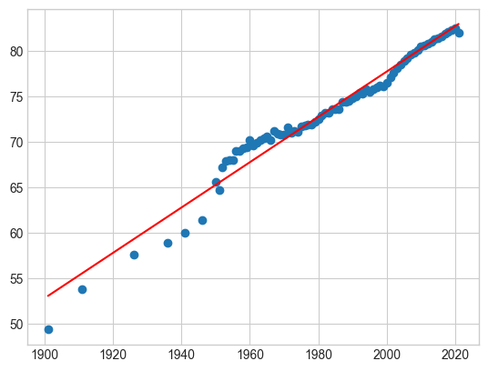

# 4th-Year-Machine-Learning

## Life Expectancy Prediction
This repository contains a [Jupyter](https://jupyter.org/) Notebook With the means to run a machine learning script to predict the life expectancy in the future of a given country

**Data**
the data was recieved from [Our World In Data](https://ourworldindata.org/life-expectancy) which gives a data set containing the following columns:
- **Entity:** this column has the name of the entity of the rest of the data (Ireland, Africa, World)
- **Code:** this column has the country code of the Entity or is blank for contenents or regions
- **Year:** this column has the year of the row of data
- **Period life expectancy at birth - Sex: all - Age: 0:** this column has the life expectancy from birth in years

The data is taken in using pandas and stored in a variable

**Pre-Processing**

The data is first processed to remove extreamly old dates (<1800) as there is very little data and it severely effects the results, also renaming the **Period life expectancy at birth - Sex: all - Age: 0** column to the more managable **Life Expectancy**
all rows with no country code is droped to remove regions and contenents from the data set, followed by **OWID** values as they are areas like **World** and **USSR**

**Input**

A list of unique countries that can be used as an input is then calculated and output in a list format
The input section can take one of these countries and a year to predict from

**linear Regression**

The data is then plot on a graph, Like this example graph of Ireand:

then using numpy the line of best fit is found for the data, here is the line of best fit for the above graph:

**Prediction**
Using the entered country, year and the line of best fit, the life expectancy is predicted.

For example, with the above graph of Ireland and a year input of 2050 the prediction is:

`predicted life expectancy for Ireland in the year 2050: 90.16580187637373`
